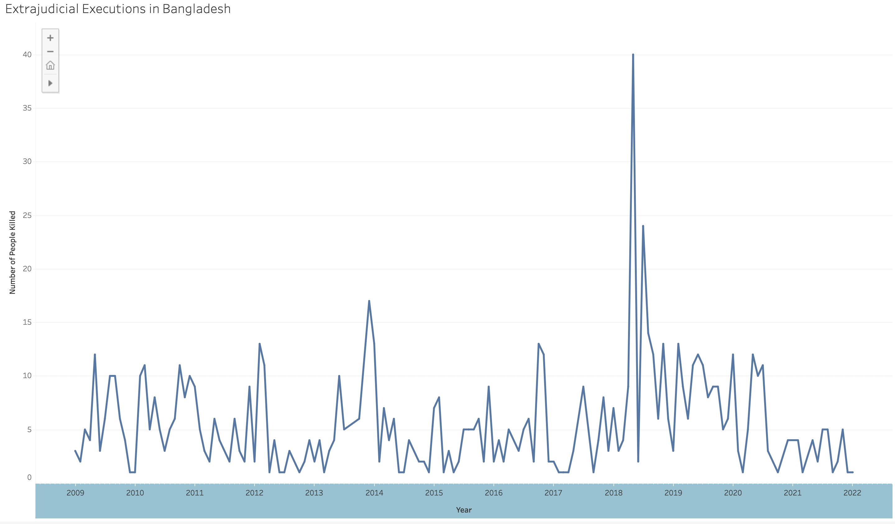
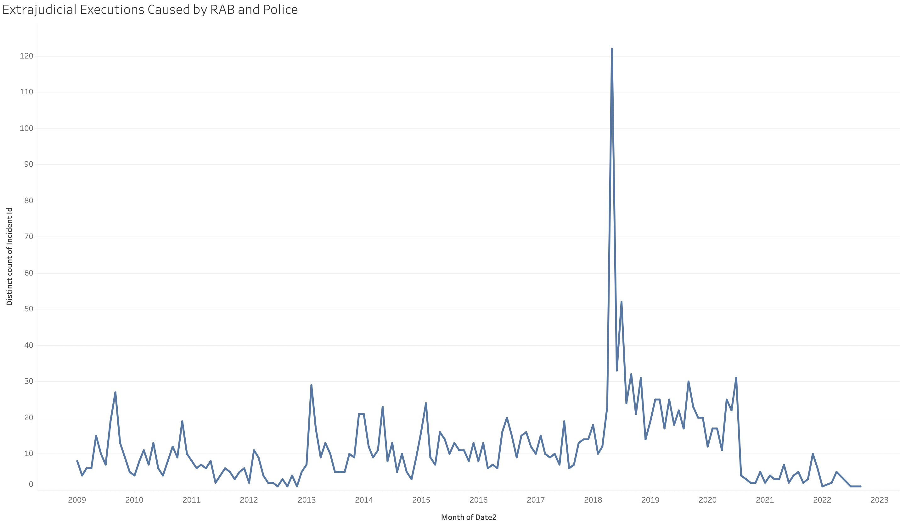
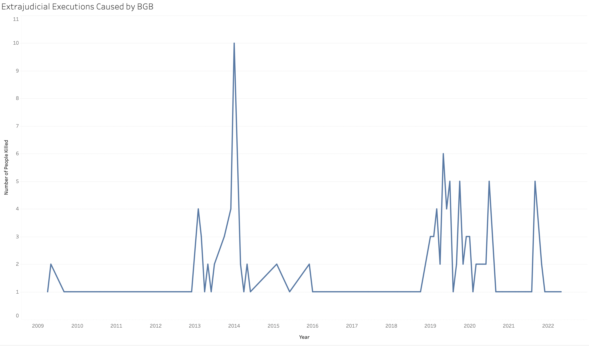
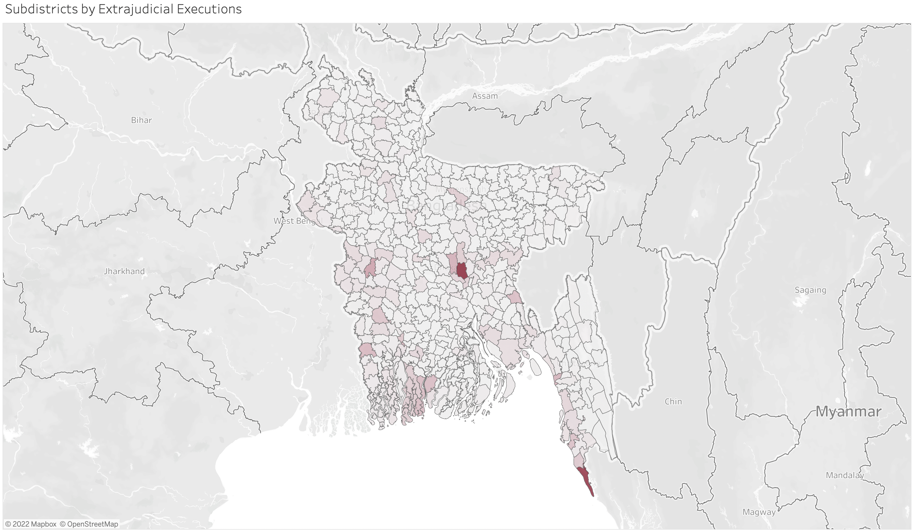

###### ejk_1.1

# Visualizing Bangladesh’s Extrajudicial Killings Statistics

###### Nazmul Ahasan
nazmul@berkeley.edu

## Modified Reporting Questions

After cleaning up and analyzing the dataset, I modified my initial reporting questions. The modified dataset can answer the following questions.

* Were there any periods (e.g., elections) when killings particularly peaked?
* Since most executions were carried out by RAB and Police, are there any trends in how those executions were conducted?
* In which sub-district or district(s) did most killings take place?

### Were there any periods when killings particularly peaked?

The data shows that extrajudicial executions peaked right before the elections. One could witness the biggest rise in executions right before the 2014 and 2018 general elections. The 2018 period was particularly violent as the government also launched a anti-drug campaign. However, casualties from these operations sharply dropped in early 2019. 

[Tableau](https://public.tableau.com/app/profile/nazmul.ahasan/viz/Rab-Police/overall)

#### Since most executions were carried out by RAB and Police, are there any trends in how those executions were conducted?

The data suggests that the executions by RAB and Police peaked in 2018, which is consistent with overall data trends. However, in 2014, casualties caused by RAB-Police did not see a jump, unlike the overall data.

[Tableau](https://public.tableau.com/app/profile/nazmul.ahasan/viz/Rab-Police/RABandPolice)

To exolain the exception, I looked into the third biggest contributor to the extrajudicial executions: Border Guard Bangladesh or BGB. The number of executions caused by BGB peaked in 2014, which contributed to an overall jump during that period. In contrast to RAB and Police, BGB’s executions did not peak during the 2018 period. The BGB’s actions during the 2014 period is interesting because the agency was at the time led by a general widely believed to be a partisan appointee. The general would later go on to head the army and was subjected to a much-hyped documentary by Al Jazeera.

[Tableau](https://public.tableau.com/app/profile/nazmul.ahasan/viz/Rab-Police/BGB)

#### In which sub-district or district(s) did most killings take place?

We cleaned the location field of the dataset. To better visualize, we decided to use sub-district location data and created a choropleth map.

[Tableau](https://public.tableau.com/app/profile/nazmul.ahasan/viz/Rab-Police/subd_map?publish=yes)

## Next Steps

The next steps will include charts involving age and other charasteristics of the victims. We can also clean the data to include other details such as custodial death and the identities of the victims (e.g., refugees, political activists, tribal leaders)

With help from Peter Aldhous, the map’s visualization may be changed from choropleth map to one where datapoints will be reflected by 3D vertical lines.

We will also create a table to present the dataset.